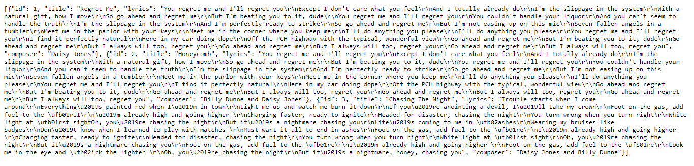
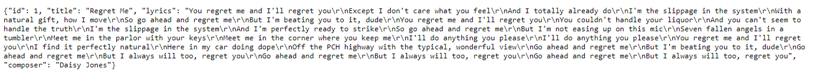
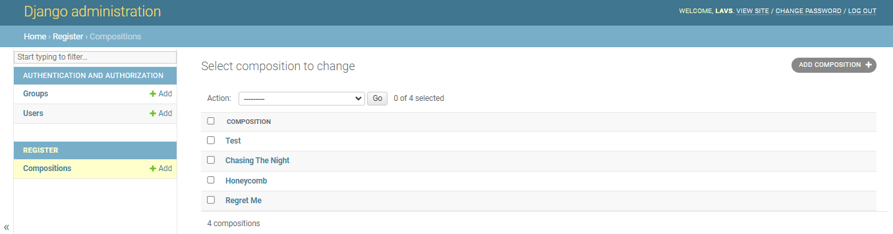
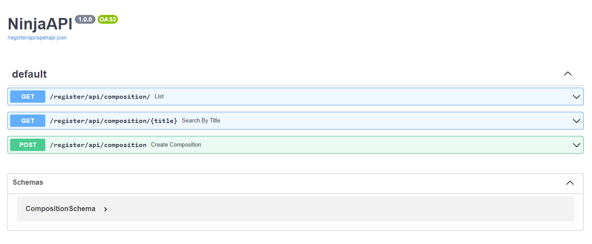
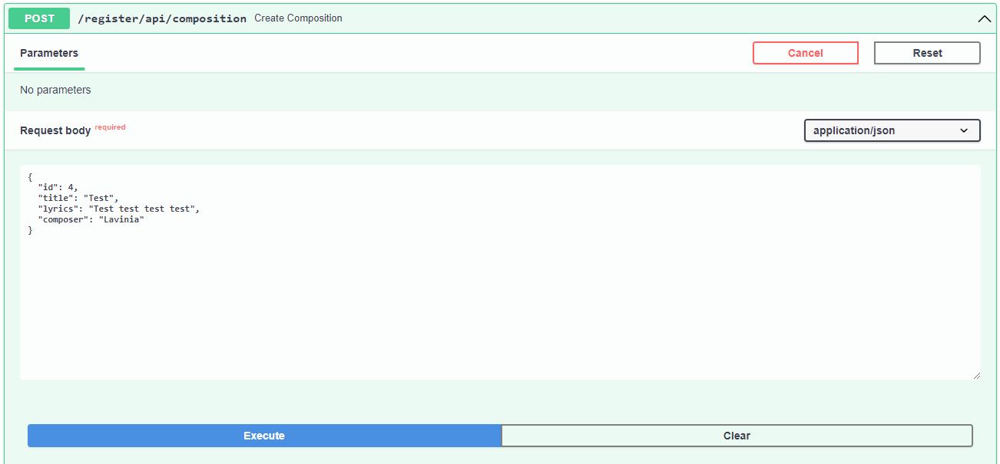
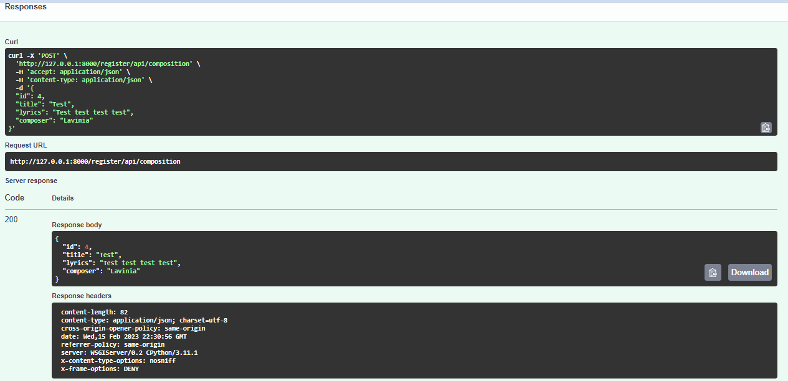

<h1 align="center"> Compositions API </h1>

  

 Projeto desenvolvido com Django Ninja e Python. 
 

  <a href="#-sobre-o-projeto">Sobre o projeto</a>&nbsp;&nbsp;&nbsp;|&nbsp;&nbsp;&nbsp; 
  <a href="#-layouts">Layouts</a>&nbsp;&nbsp;&nbsp;|&nbsp;&nbsp;&nbsp;
  <a href="#-processo-criativo">Processo Criativo</a>&nbsp;&nbsp;&nbsp;&nbsp;&nbsp;&nbsp;

</img>

# 💻 Sobre o projeto 

Compositions API é um projeto back-end focado para aprendizado introdutório do web framework Django Ninja.
O projeto consiste em uma API que se conecta com o banco de dados e deve ser capaz de armazenar composições musicais inseridas pelos usuários que devem informar 
o título da faixa, a letra e o nome do compositor.
Além disso, os demais usuários devem ser capazes de ter acesso às composições para leitura, também podendo buscar composições específicas através do título das faixas.

Para uso do projeto utilize o ambiente virtual (venv).

# 📸 Layouts 

Tela com lista das composições em formato JSON

</img>

Tela exibindo a composição Regret Me que foi inserida como parâmetro de busca

</img>
 

Tela do painel do administrador

</img>
 

Tela de documentação gerada pelo Django-Ninja

</img>
 

Teste de inserção de dados através da documentação

</img>
 

</img>
 

  

# 💡 Processo Criativo

A ideia surgiu após a leitura do livro "Daisy Jones & The Six".

</img>

Para evitar que os compositores Billy Dunne e Daisy Jones passem mais tempo do que o necessário juntos (visto que ambos não mantém uma boa convivência), 
suas composições são inseridas por eles em um banco de dados de forma que toda a banda tem acesso às letras logo após a sua inserção. Dessa forma, Billy e Daisy, 
principalmente, não precisam se encontrar pessoalmente para compartilhar suas composições.

# ✒️ Autor

Lavínia Souza Silveira

https://www.linkedin.com/in/lav%C3%ADnia-silveira-896b2624a/
